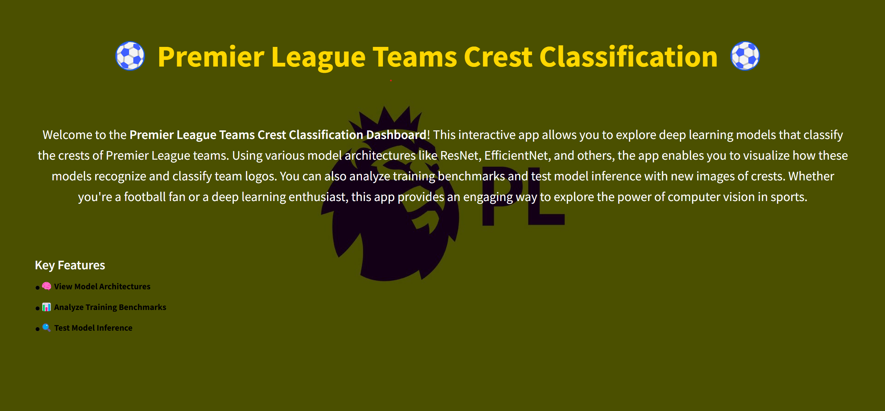
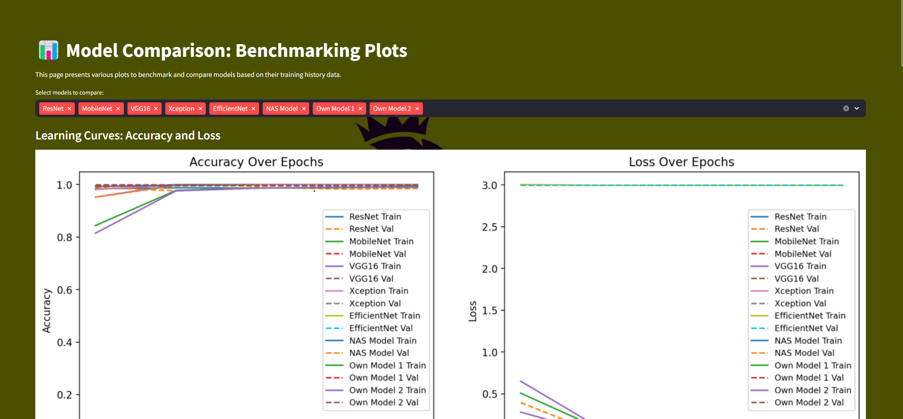
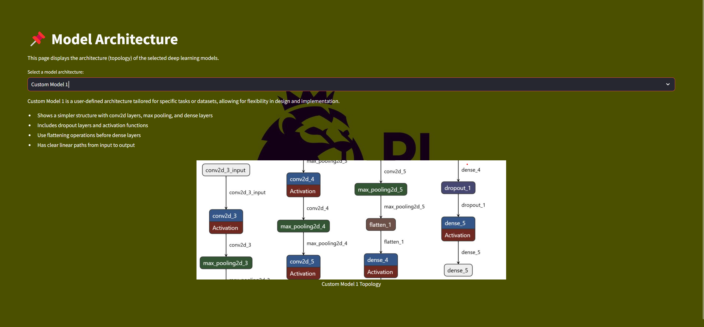
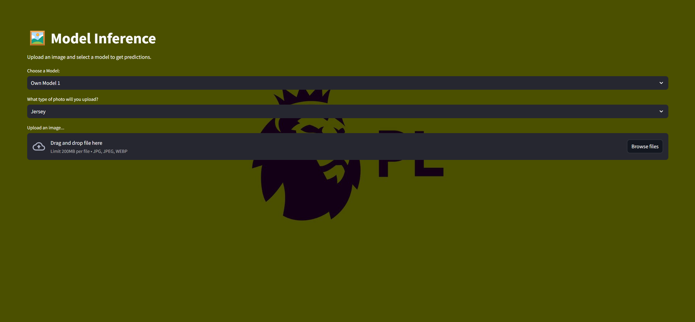

# PremierVisionAI

## Premier League Team Identifier: Logo and Jersey Analysis

PremierVisionAI is a powerful web application built using Streamlit that allows users to upload images of Premier League football team logos and jerseys. The application leverages advanced computer vision and deep learning models to identify and classify the uploaded images into their respective teams. This project serves as an interactive tool for football enthusiasts, sports analysts, and developers interested in image classification and sports analytics.

## Features

- **Model Selection:** Choose from various pre-trained models (e.g., ResNet, MobileNet, VGG16, InceptionV3, Xception, EfficientNet) or custom models for classification.
- **Image Upload:** Easily upload images in formats such as JPG, PNG, JPEG, and WEBP.
- **Real-Time Predictions:** Get instant predictions on uploaded images with confidence scores and visual feedback.
- **Logo and Jersey Classification:** Precisely classify images as either logos or jerseys of different Premier League teams.
- **Object Detection:** Identify and locate team logos and emblems within complex images using advanced YOLO models.
- **Image Segmentation:** Extract and isolate key objects from images for clearer identification and analysis.
- **Neural Style Transfer:** Apply the visual style of one image to another, creating artistic variations of team logos and jerseys.
- **User-Friendly Interface:** A clean, responsive web interface built with Streamlit for intuitive navigation and operation.

## Application Screenshots

### 1. Home Page

The **Home Page** serves as the main entry point of the application. It provides an overview of the functionalities available and allows users to navigate to different sections of the app.
<br>

### 2. Benchmarks of All Models

The **Benchmarks Page** presents a comparative analysis of all available models. Users can view performance metrics such as accuracy, precision, and recall for each model, helping them understand which model performs best for their specific use case.
<br>

### 3. Model Architectures of All Models

This page displays the architecture diagrams for each model implemented in the application. Users can explore the design and structure of various models like ResNet, MobileNet, and more, providing insights into how each model processes input data.
<br>

### 4. Inference Page

The **Inference Page** allows users to upload images and get real-time predictions based on the selected model. After uploading an image, users can see the predicted class.

## Technical Implementation
The application integrates multiple advanced technologies:

- **Deep Learning Models:** Including YOLO for object detection, VGG19 for neural style transfer, and various classification models
- **Computer Vision Techniques:** OpenCV for image processing and GrabCut for background removal
- **TensorFlow & PyTorch:** For model implementation and inference
- **Streamlit:** For creating a responsive and interactive web interface

## Data
The data used to train the models was sourced from [Kaggle's Premier League Logo Detection dataset](https://www.kaggle.com/datasets/alexteboul/english-premier-league-logo-detection-20k-images?utm_source=chatgpt.com). This dataset includes a diverse collection of images categorized by team, providing the necessary information for accurate model training and evaluation.

## Model Files
Due to their large size, the pre-trained model files have not been included in this repository. However, you can easily generate your own models by utilizing the provided training scripts and architecture definitions. The models are stored in the `Models` directory, with the main detection model accessible as `Models/best.pt`.

## Requirements

To run this project, install the following dependencies:

- Python 3.8+
- Streamlit
- TensorFlow
- PyTorch
- Ultralytics YOLO
- OpenCV
- PIL
- NumPy

## Getting Started

1. **Clone this repository:**
   ```bash
   git clone https://github.com/yourusername/PremierVisionAI.git
   cd PremierVisionAI
   ```
2. **Install required dependencies:**
   ```bash
   pip install -r requirements.txt
   ```
3. **Run the application:**
   ```bash
   streamlit run Home.py
   ```
4. **Navigate through the different pages to explore all features.**

## License

This project is licensed under the MIT License - see the [LICENSE.md](LICENSE.md) file for details.

